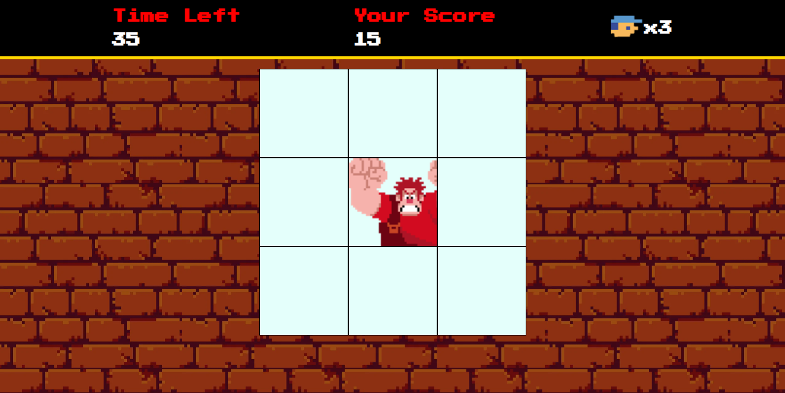

# Detona Ralph
Este é um projeto de jogo baseado no filme "Detona Ralph". O objetivo do jogo é clicar nos quadrados que contêm o inimigo para ganhar pontos antes que o tempo acabe. Foi desenvolvido como desafio de projeto durante um bootcamp da Digital Innovation One (DIO).



## Estrutura do projeto
```index.html
src/
    audios/
        hit.m4a
    images/
        favicon.jpg
        player.png
        ralph.png
        wall.png
    scripts/
        engine.js
    styles/
        main.css
        reset.css
image.png
index.html
README.md
```

# Descrição dos Arquivos
- index.html: Arquivo principal que estrutura a página do jogo.
- src/audios/: Contém os arquivos de áudio utilizados no jogo.
- src/images/: Contém as imagens utilizadas no jogo.
- src/scripts/engine.js: Contém a lógica principal do jogo.
- src/styles/main.css: Contém os estilos principais do jogo.
- src/styles/reset.css: Contém os estilos de reset para garantir consistência entre navegadores.

## Como Jogar
1. Abra o arquivo index.html em um navegador.
2. O jogo começará automaticamente.
3. Clique nos quadrados que contêm o inimigo (Ralph) para ganhar pontos.
4. O jogo termina quando o tempo acaba.
5. Para reiniciar, basta dar reload na página

## Funcionalidades
- Contagem Regressiva: O tempo restante é exibido e decrementado a cada segundo.
- Pontuação: A pontuação do jogador é atualizada a cada clique bem-sucedido no inimigo.
- Som: Um som é reproduzido a cada clique bem-sucedido no inimigo.

## Tecnologias Utilizadas
- HTML
- CSS
- JavaScript

## Créditos
Este projeto foi desenvolvido como parte de um exercício de programação. As imagens e sons utilizados são de propriedade de seus respectivos donos.

## Licença
Este projeto é de uso livre para fins educacionais e não comerciais.
